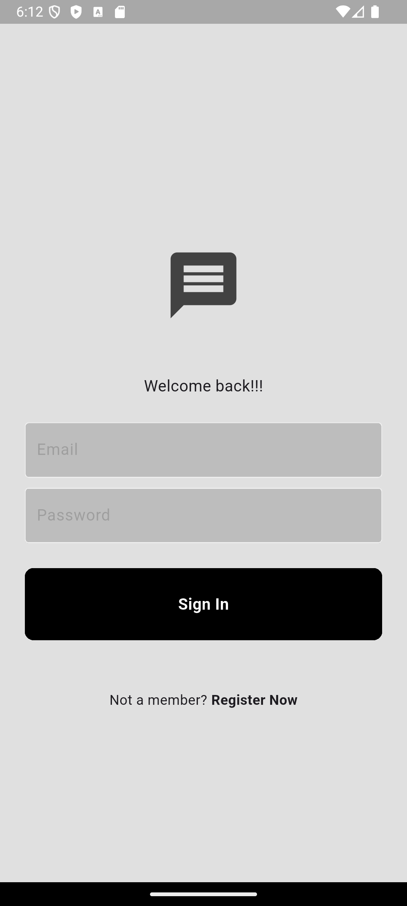
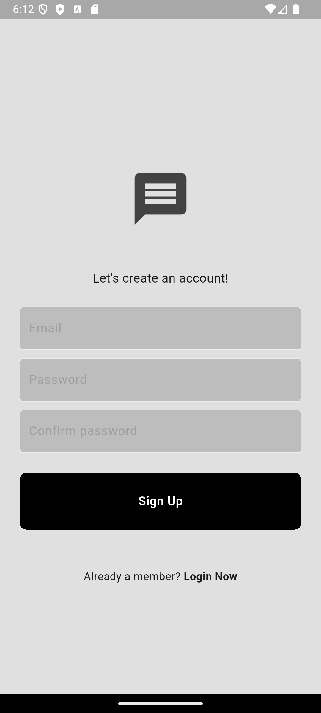
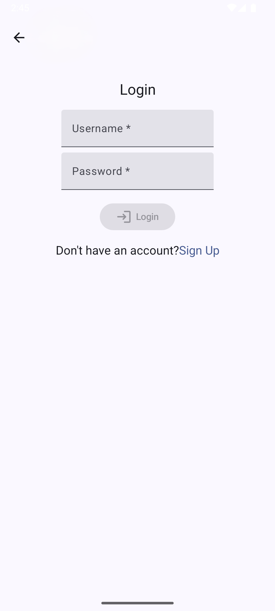
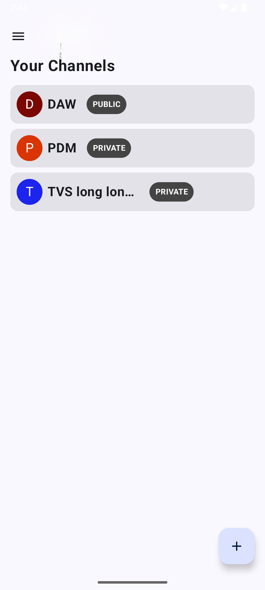
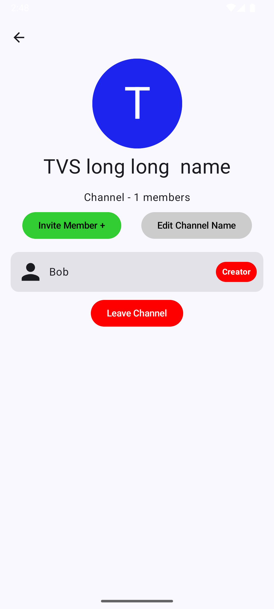
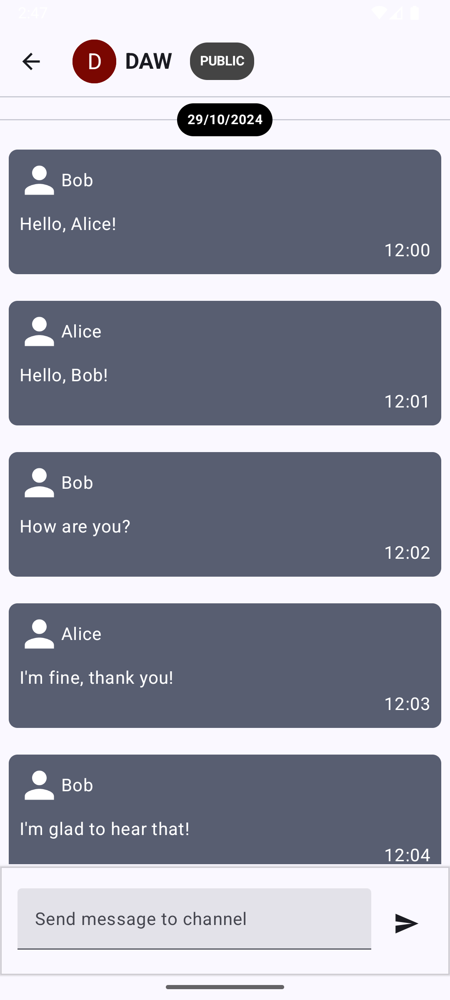

# 📱 Улучшение UX Android мессенджера на Flutter

## 📊 Оценка по атрибутам качества Usability (ISO/IEC 25010:2011)

### 1. 🔍 Распознаваемость соответствия
**Оценка:** Средний уровень. Интерфейс мессенджера понятен, но некоторые элементы управления могут быть неочевидны для новых пользователей.  
**Улучшение:** Добавление подсказок и интерактивных элементов, улучшение визуальной иерархии.

### 2. 📚 Обучаемость
**Оценка:** Средний уровень. Интуитивность интерфейса хорошая, но есть сложности в настройках уведомлений и конфиденциальности.  
**Улучшение:** Введение интерактивного туториала, более чёткое оформление разделов настроек.

### 3. ⚙️ Используемость (операбельность)
**Оценка:** Хороший уровень, но наблюдаются задержки при обмене сообщениями и загрузке медиафайлов.  
**Улучшение:** Оптимизация производительности и кэширования данных, использование асинхронной загрузки.

### 4. 🚫 Защита от ошибок пользователя
**Оценка:** Средний уровень. Возможны случайные удаления сообщений без подтверждения.  
**Улучшение:** Введение механизма "Отменить действие", добавление подтверждений перед критическими изменениями.

### 5. 🎨 Эстетика GUI
**Оценка:** Высокий уровень, но некоторые экраны перегружены элементами.  
**Улучшение:** Упрощение UI, применение принципов Material Design для более минималистичного дизайна.

### 6. ♿ Доступность
**Оценка:** Низкий уровень. Отсутствует поддержка для пользователей с ограниченными возможностями.  
**Улучшение:** Внедрение поддержки экранных читателей, контрастных тем и удобной навигации.

---

## 🚀 Пути улучшения UX

1. **Упрощение интерфейса** – снижение перегруженности экранов и оптимизация визуальной иерархии.
2. **Добавление онбординга** – интерактивные подсказки и обучающие экраны при первом входе в приложение.
3. **Оптимизация производительности** – ускорение обмена сообщениями, кэширование медиафайлов и изображений.
4. **Поддержка доступности** – контрастные режимы, озвучивание элементов интерфейса, удобная навигация с клавиатуры (в случае web-версии).
5. **Обновленный дизайн чата** – современный внешний вид, интуитивно понятные элементы управления для отправки сообщений и медиа.

---

## 🎉 Улучшения "До и После"

### 💬 Пример 1: Улучшение списка чатов
**До:** Плотный интерфейс, трудно найти нужный чат.  
**После:** Введение фильтров и улучшенный поиск, уменьшение количества отображаемых элементов.

### 📲 Пример 2: Оптимизация интерфейса отправки сообщений
**До:** Кнопки расположены не очень удобно, сложно добавлять медиафайлы.  
**После:** Чёткое разграничение зон управления, улучшенный дизайн отправки и добавления медиафайлов, интеграция жестов для мобильных устройств.

### 🔔 Пример 3: Улучшение системы уведомлений
**До:** Частые и навязчивые push-уведомления, нет возможности управлять ими.  
**После:** Центр уведомлений, ненавязчивые уведомления, возможность настраивать приоритет уведомлений.

---

### 📸 Первая версия приложения до

  
 

### 🌟 Улучшенная версия после

  
  
    
    

## 📝 Заключение

Проведённые улучшения сделают ваш мессенджер на Flutter более удобным и отзывчивым для пользователей. Интеграция лучших практик UX-диз
